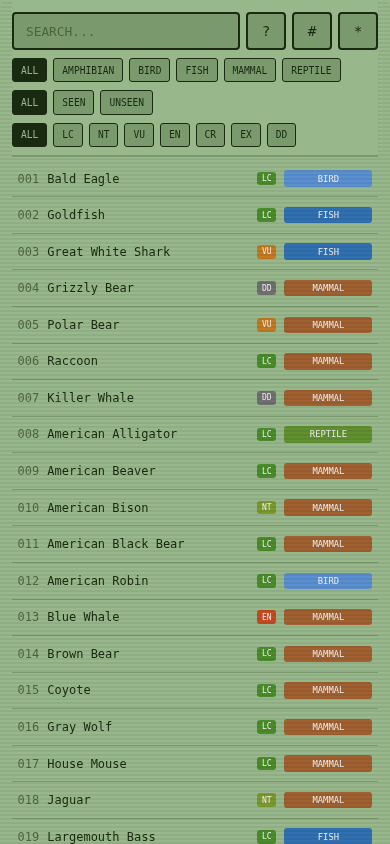
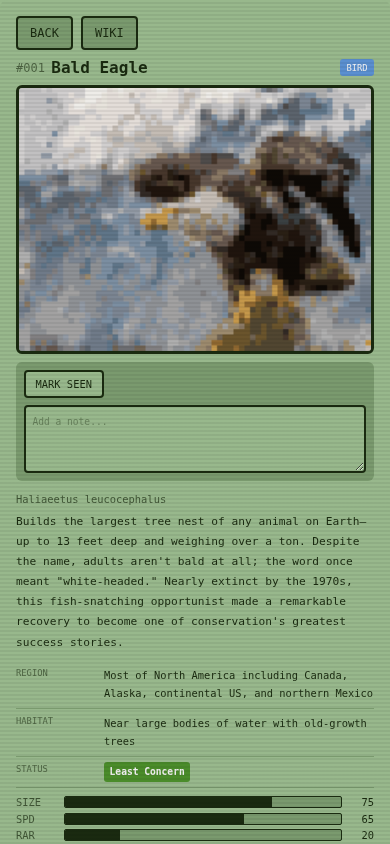

# American Wildlife Pokedex

A retro-styled PWA catalog of North American wildlife, inspired by the Pokedex from Pokemon. Browse 2,800+ species with pixelated sprites, stat bars, search, type/status filtering, and a sighting log to track what you've seen in the wild.

<p align="center">
  
  
</p>

## Features

- **Search & filter** — by name, type (Bird, Mammal, Reptile, ...), IUCN conservation status, or seen/unseen
- **Species cards** — pixelated sprite, hi-res photo toggle, stat bars (size, speed, rarity, danger), habitat, region, Wikipedia link
- **Sighting log** — mark species as seen with dates and notes, sorted reverse-chronologically
- **Offline-capable** — installable PWA with full offline support via service worker
- **Mobile-first** — designed for phones, works down to 320px

## Quick Start

```
npm install
npm run dev
```

## Tech Stack

Vite + Preact + plain CSS. No runtime dependencies beyond Preact (~3KB). Hosted on GitHub Pages.

## Tests

```
npm test
```

76 tests covering hooks, components, and navigation using vitest + @testing-library/preact.
